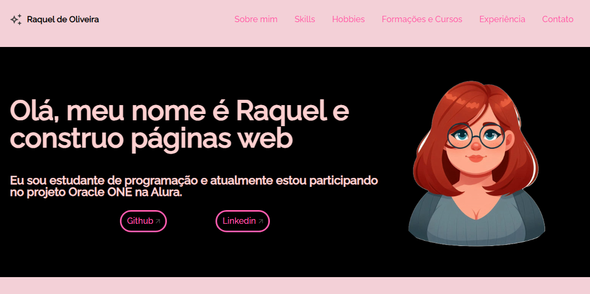

# Challenge ONE | Front End - Portfólio
---

### Este projeto é um desafio proposto pelo programa T-6 ONE, parceria com a alura LATAM e a Oracle.

     

     

Link do projeto: https://desafio-portif-lio.vercel.app/

🛠️ Construído com
HTML, CSS e JavaScript.

✒️ Autores

Alura - Trabalho Inicial 
Raquel Oliveira - Desenvolvimento

🎁 Agradecimentos
Agradeço a Alura e Oracle pela oportunidade de participar do programa e ter contato com a programação Front-end pela primeira vez!
Também agradeço a equipe do T6-ONE pela dedicação e empenho neste programa.

